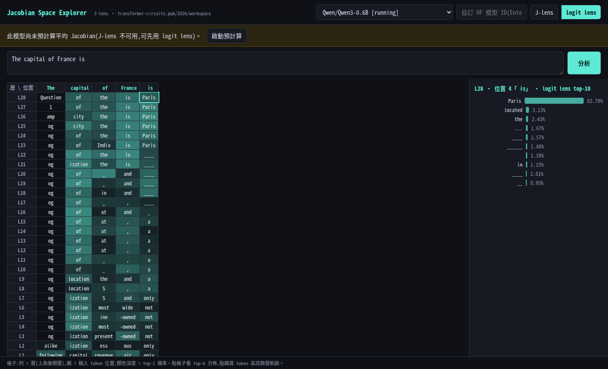

# jspace — Jacobian Space (J-lens) Explorer

以互動網頁視覺化一段輸入文字在 LLM 中的 **Jacobian Space**:模型在每一層、每個位置「準備說出」(poised to verbalize) 的 token 及其機率。

忠實實作 Anthropic 論文 [*Verbalizable Representations Form a Global Workspace in Language Models*](https://transformer-circuits.pub/2026/workspace/) 的 **J-lens** 方法,套用於開源模型(Qwen3、SmolLM2 等任意 HuggingFace causal LM)。



## 方法

J-lens 對每一層 ℓ 預先計算「平均 Jacobian」:

```
J_ℓ = E[ ∂h_final,t' / ∂h_ℓ,t ]        對位置 t ≤ t' 與 ~1000 條 pretraining 語料取平均
lens(h_ℓ) = softmax(W_U · norm(J_ℓ · h_ℓ))
```

`J_ℓ` 把中間層 residual stream「翻譯」到最終層座標系再 unembed,因此(不同於 logit lens)在早期與中期層也能讀出可解讀的 token 分佈。

精確 Jacobian 不可行(需 d_model 次 backward / 位置),本實作用**隨機投影蒙地卡羅**無偏估計:

```
Ĵ_ℓ = (1/N) Σᵢ uᵢ ⊗ (uᵢᵀ J_ℓ),   uᵢ ~ N(0, I)
```

每次 backward 以隨機向量 `u` 從 final residual stream 反傳,一次取得**所有層、所有來源位置**的 VJP。估計器的無偏性與收斂性由測試對解析 Jacobian 驗證(`tests/test_jacobian_math.py`)。

實作細節:

- 一律使用 **pre-norm 的原始 residual stream**(新版 transformers 的 `hidden_states[-1]` 已套 final norm,以 forward pre-hook 取回 norm 輸入,避免雙重 norm)
- 權重凍結、僅對激活建圖(`inputs_embeds` 路徑),省記憶體
- fp32 累加器 + checkpoint,預計算可中斷續算
- 語料:FineWeb(英)+ FineWeb-2 中文(多語模型)

## 使用

```bash
uv sync
uv run python -m jspace serve            # http://localhost:7860
```

網頁流程:選模型 → 輸入文字 → 分析。未預計算的模型可先用 **logit lens**,按「啟動預計算」在背景計算平均 Jacobian(0.6B 模型約 1 小時,GB10),完成後自動切到 **J-lens**。

CLI 預計算:

```bash
uv run python -m jspace precompute Qwen/Qwen3-0.6B --num-prompts 1000
```

快取位置:`~/.cache/jspace/<model>/jacobians.safetensors`

## 介面

- **主格子**:列 = 層(上為後期層)、欄 = 輸入 token 位置;每格顯示該處 top-1 token,背景深度 = 機率
- **點格子**:側欄顯示該 (層, 位置) 的 top-k 機率長條
- **點欄首 token**:高亮該位置的跨層軌跡
- **J-lens ⇄ logit lens** 一鍵切換,直接對照論文宣稱的早期層可讀性差異

## 測試

```bash
uv run pytest
```

- MC 估計器對解析 Jacobian 的收斂性(無偏性驗證)
- 快取 round-trip、lens 讀出一致性(J=I 時退化為 logit lens;最後一層 = 模型真實 next-token 分佈)
- API 功能測試(tiny 模型)

## 需求

- Python ≥ 3.12、`uv`
- CUDA GPU(在 DGX Spark GB10 / CUDA 13 上開發);CPU 亦可但預計算很慢
